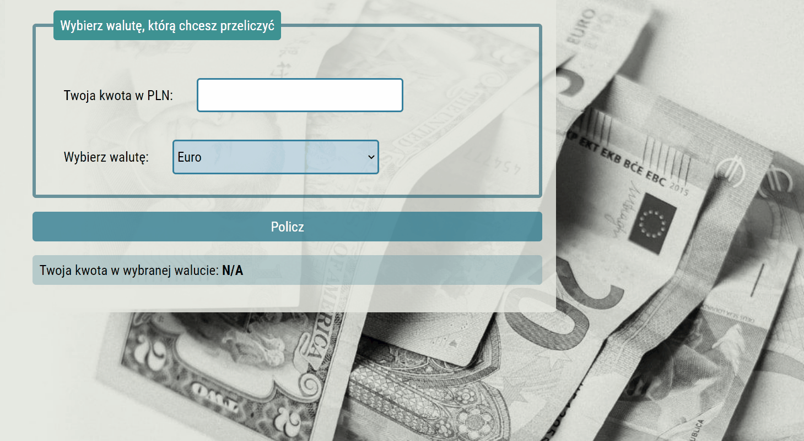

# 💱 Currency-converter

## 🔍 Demo
([https://marianna-weychan.github.io/currency-converter/](https://marianna-weychan.github.io/currency-converter/))

##  ⌨️ Short description

Simple currency converter.
From the amount you provide in PLN, it will calculate amounts in 4 selected currencies.
Enter your amount in PLN, and then select the currency in which you want to get the new amount.

## 👩‍💻 Used Technoligies:
- HTML,
- CSS,
- BEM convention,
- JAVA SCRIPT,
- GIT
